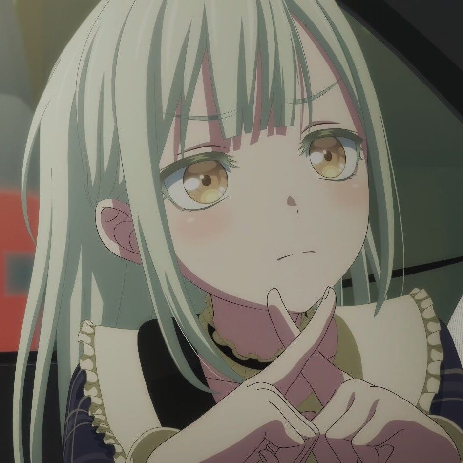

## Hi there 👋
I'm af8a2a,a Game/Graphics Developer.
- I'm interested in Game Graphics Development.
- New Rustacean, exploring the Rust language in Rendering;
- [VividRP](https://github.com/af8a2a/VividRP) is a Unity Rendering Pipeline Extension.Implement my interest effect,Graphics features or tool in Custom URP.
- [Readings](https://github.com/af8a2a/readings) is a collection of my reading materials.
- [vk_rs](https://github.com/af8a2a/vk_rs) my Vulkan Playground in Rust.
- [raytracing-rs](https://github.com/af8a2a/raytracing-rs) my toy Raytracing implement in Rust.

